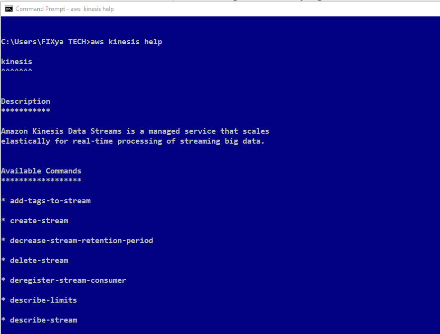

# kinesis-data-streams-projects-01

# Overview

In this project we will be creating a simple Amazon Kinesis application and using the AWS CLI to put records into the stream and read to check records in the streams

Amazon Kinesis Data Streams is a serverless streaming data service that makes it easy to capture, process, and store data streams at any scale.

Some features
- Data inserted into Kinesis data stream can’t be deleted ( Data retention period 24 hours(default) but can be increased) 
- Records with the same partition goes into the same shard
- Producers: AWS SDK, Kinesis Producer Library (KPL), Kinesis Agent
- Consumers: AWS SDK, Kinesis client Library (KCL), Kinesis Data Firehose, Kinesis Data Analytics

Amazon Kinesis Data Streams Capacity Modes
- Provisioned mode: You can choose the number of shards provisioned, scale manually or using API, send 1MB/S of data to shard and get 2MB/S out of shard
- On-demand mode: No need to provision or manage the capacity. Provisioned capacity maximum 200MiB/second write capacity and maximum 400 MiB/second read capacity

# Intructions 

# Stage 1 - Create Amazon Kinesis Application

Head to the Amazon Kinesis Services dashboard to create a Kinesis Data Stream . 
We have three options : **Kinesis Data Stream** , **Kinesis Data Fireshose** and **Kinesis Data Analytics**
Select **Kinesis Data Stream** 
and then click on **Create data stream**

Enter a name for your Kinesis Stream. In this tutorial, we will call our stream **"DemoStream"**

For the capacity mode : Select **Provisioned mode** 
Set the number of shards value to **1** which can be increased or describe later

Click on **Create Stream** to create the stream. You can wait for just some few seconds to get the stream created

Afterwards our stream should be in the **"Active" state**.

# Stage 2 - Create a producer to put records into the Kinesis Data Stream
In this tutorial we are going to use the AWS CLI to communicate with the Amazon Kinesis Service

This tutorial assume you have already installed and configured AWS CLI.
You can follow this Documentation [https://docs.aws.amazon.com/cli/v1/userguide/install-windows.html] to install and configure the AWS CLI for your OS. We are using windows 10 for this tutorial. 

To confirm that the AWS CLI has been installed and configured on your computer, you can check the installed version by typing "**aws -version**" which should print the version of the AWS CLI that is installed.

We can view a list of avaialable commands by typing **aws kinesis help**

Let's check the list of created Kinesis Data Streams in our account by typing  **aws kinesis list-streams**

Now lets put some records into the stream. 
We can use the **PutRecord** to put one record into the stream or **PutRecords** to put many records into the stream

We are going to simulate data coming from a BANK ATM whose data has to be streammed into Kinesis Data Streams for further processing. 

We can use the command below to send a record to the stream.

**C:\Users\FIXya TECH>aws kinesis put-record --stream-name myDemo --partition-key 1 --cli-binary-format raw-in-base64-out  --data "{'trans_id': 1, 'trans_type': 'ATM', 'amt': 200}"**

 - aws kinesis  **put-record**\         -                            put-record used to put a single record into the stream

 - --stream-name  **DemoStream**\       -                            We are passing in the name of our created stream. In this case **DemoStream**

 - --partition-key  **1**\              -                            We are defining a partition key for this put operation

 - --cli-binary-format  **raw-in-base64-out**\        -              A flag that specifies how the binary input paramaters should be interpreted. In this case **raw-in-                                                                     base64-out**

 - --data **"{'trans_id': 1, 'trans_type': 'ATM', 'amt': 200}"** -  The data blob to be put into the stream. In this case **"{'trans_id': 1, 'trans_type': 'ATM' ,                                                                         'amt':200}"**
 

In this example we are using the PutRecord API to put the following 4 records into the stream one by one. Its also possible to use the PutRecords API to write many records at once into the stream 
 1. aws kinesis put-record --stream-name DemoStream --partition-key 1 --cli-binary-format raw-in-base64-out --data "{"trans_id": 1, "trans_type": "ATM", "amt":   200}"
 2. aws kinesis put-record --stream-name DemoStream --partition-key 1 --cli-binary-format raw-in-base64-out --data "{"trans_id": 2, "trans_type": "ATM", "amt":   400}"
 3. aws kinesis put-record --stream-name DemoStream --partition-key 1 --cli-binary-format raw-in-base64-out --data "{"trans_id": 3, "trans_type": "ATM", "amt":   600}"
 4. aws kinesis put-record --stream-name DemoStream --partition-key 1 --cli-binary-format raw-in-base64-out --data "{"trans_id": 4, "trans_type": "ATM", "amt":   900}"
 
After a successful PutRecord API operation, we should get a response object containing the ShardID and the Sequence Number

A **Shard** is a uniquely identified group of data records in a Kinesis data stream

The **Sequence Number** is the identifier associated with every record ingested in the stream, and is assigned when a record is put into the stream. Each stream has one or more shards

Next we want to read records from the stream

First lets get the shards iterator which specifies the shard position from which to start reading data records sequentially. 

aws kinesis **get-shard-iterator**\               to get an Amazon Kinesis shard iterator.It expires 5 minutes after it is retuerned to the requester
- --stream-name **DemoStream** \                  We are passing in the name of the created stream. In this case **DemoStream**
- --shard-id **shardId-000000000000** \           We are passing in the **shardId** of the shard in our stream
- --shard-iterator-type **TRIM_HORIZON** \        We are passing in the shard iterater type whicn can be **AT_TIMESTAMP**, **TRIM_HORIZON** or **LASTEST**. In                                                            this project we have used **TRIM_HORIZON** to cause the shardIterator to point to the last untrimmed record in                                                          the shard(Oldest data record in the shard)

We can use the command below to get the shard iterator
**aws kinesis get-shard-iterator --stream-name DemoStream --shard-id shardId-000000000000 --shard-iterator-type TRIM_HORIZON**

We can now use the the GetRecords API to get data records from a Kinesis data stream's shard by specifying the shardIterator.  
aws kinesis get-records --shard-iterator\ AAAAAAAAAAE/fk1qZTWLE74jIwqLR/N1OqYDsi9d7KHPhTtk7XIF42kEAJdwg0x0oXlZK/5SC7LciGiW5M3IEHdl/WH4cVYvNO1vvTTNra21WQgOUbgODyGfSeDMhd74BGi7z4l/X0Mi9O98Nexx2uSJx5ZHweKaZzEyRm4wkAYHJ4cmzwV1o2W+h/XBXrjdFB1bAKrj4/fYTGDRwvAVuA79qMoWB9vvq6ZhvYUAOLrQXGEK/sjH9g==

After a succesful **GetRecords** API call, it returns an object containing the **four data records** put in the kinesis data stream and the **next shard iterator**.

Another alternative to send test data to your **Amazon Kinesis stream** or **Amazon Kinesis Firehose delivery stream** is the **Amazon Kinesis Data Generator**.

I hope to do another tutorial on this in the future.

